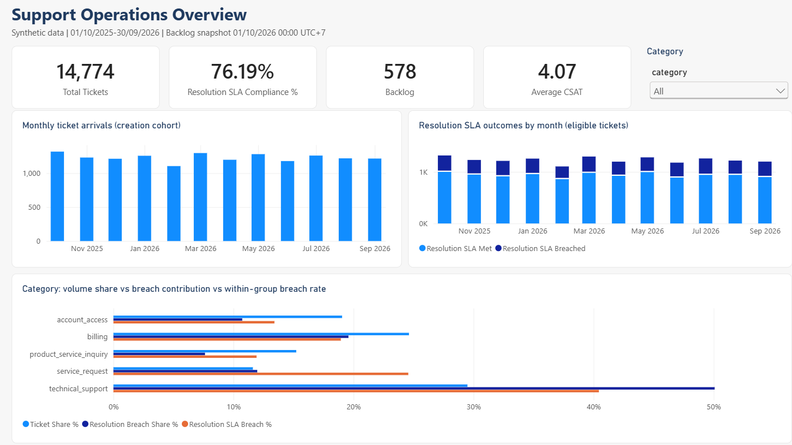
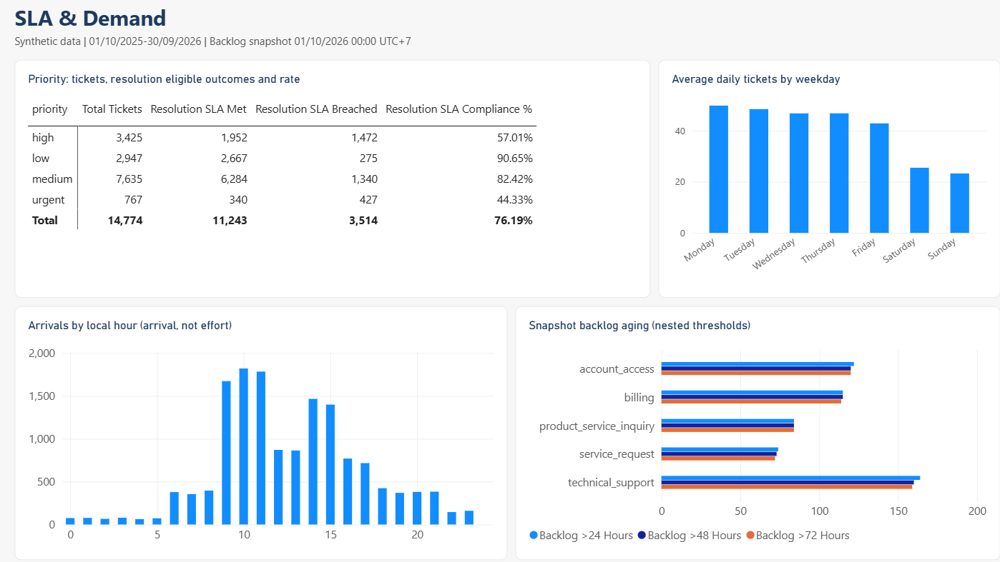
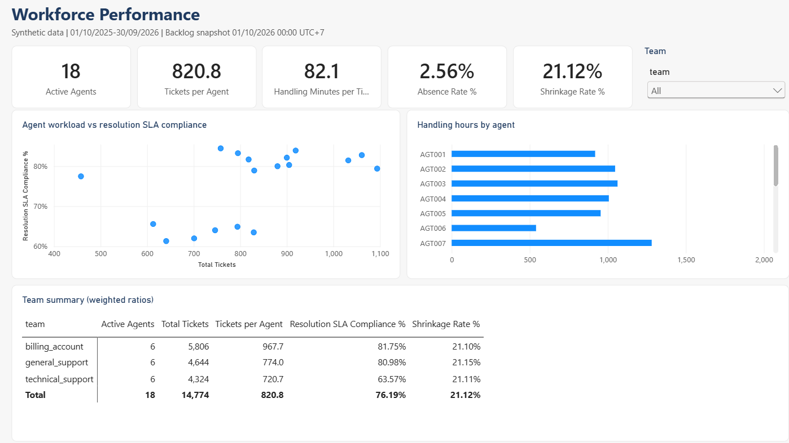
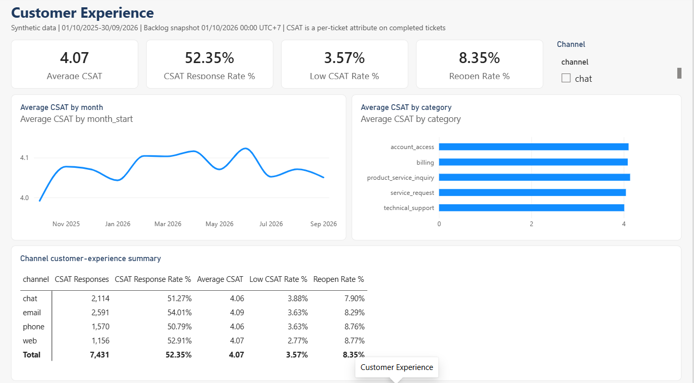
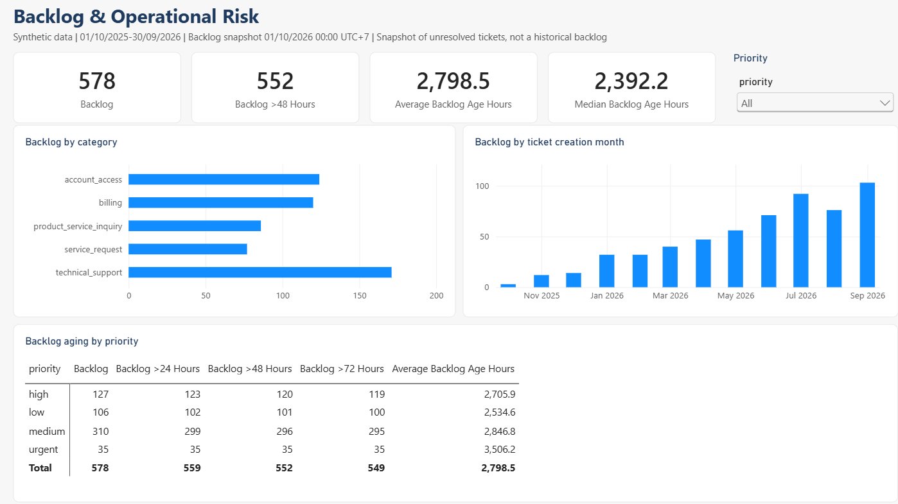

# Phân tích vận hành Customer Support

[](https://github.com/HoangLong1802/support-ops-analytics/actions/workflows/mysql-validation.yml)

[English](README.md) | **Tiếng Việt**

Dự án phân tích vận hành hỗ trợ khách hàng: Python để làm sạch dữ liệu, MySQL và Excel để phân tích, và báo cáo Power BI 5 trang. Dự án xem xét lượng ticket, tuân thủ SLA, backlog, mức hài lòng của khách (CSAT) và khối lượng công việc của agent.

> **Dữ liệu là dữ liệu mô phỏng.** Tôi tự tạo (seed 42, xem [docs/data_source.md](docs/data_source.md)) để luyện tập với dữ liệu "bẩn" giống thực tế: trùng lặp, ngày sai, danh mục không nhất quán. Các quy luật như "technical support yếu nhất" đến từ bước mô phỏng, không phải từ một công ty thật, nên các phát hiện không phải kết quả kinh doanh.

## Dữ liệu

Năm bảng: ticket, agent, chính sách SLA, work log theo ngày và ca làm việc. 18 agent chia 3 team, ticket từ 01/10/2025 đến 30/09/2026. Backlog là ảnh chụp tại 01/10/2026 00:00 (UTC+7).

Trong 15.105 dòng ticket thô, tôi loại 75 dòng trùng hoàn toàn, cách ly 256 dòng không đáng tin và giữ lại 14.774 ticket. Chi tiết: [docs/data_quality_report.md](docs/data_quality_report.md).

## Phát hiện chính

- **Technical support** chiếm 29% ticket nhưng gây một nửa số vi phạm SLA giải quyết. Trong riêng nhóm này, 40% ticket vi phạm. SLA giải quyết của team technical support là 63,6%, so với khoảng 81% ở hai team còn lại.
- **Ngày thường** trung bình 46,9 ticket/ngày, cuối tuần 24,4 (gấp 1,9 lần).
- **Backlog** có 578 ticket đang mở hoặc chờ, trong đó 552 ticket quá 48 giờ.
- **SLA:** phản hồi đầu tiên đạt 87,9%, giải quyết đạt 76,2%.
- **CSAT** trung bình 4,07/5, nhưng chỉ 52% ticket hoàn tất có đánh giá nên không nên suy diễn nhiều.

Chi tiết và giới hạn: [docs/05_business_insights.md](docs/05_business_insights.md).

## Báo cáo Power BI







File báo cáo: [powerbi/customer_support_operations.pbix](powerbi/customer_support_operations.pbix). Ảnh được chụp từ Power BI Desktop. Xem thêm [powerbi/README.md](powerbi/README.md).

## Kiểm tra

Tôi tính lại các KPI chính bằng Python thuần và so với kết quả DAX. 19/21 kiểm tra khớp; hai measure theo thời gian (trung bình trượt 30 ngày, thay đổi theo tháng) chưa được tính lại độc lập. Xem [docs/test_report.md](docs/test_report.md).

Các script MySQL chạy trên GitHub Actions với MySQL 8.4 thật (xem badge phía trên); tôi chưa chạy trên MySQL cài local.

## Cách chạy

Python 3.12+ với pandas, NumPy và openpyxl.

```powershell
python -m venv .venv
.\.venv\Scripts\python.exe -m pip install -r requirements.txt
.\.venv\Scripts\python.exe src/run_pipeline.py
```

Thêm: [docs/how_to_run.md](docs/how_to_run.md).

## Cấu trúc thư mục

| Thư mục | Nội dung |
|---|---|
| `data/` | CSV thô, đã xử lý và dữ liệu phân tích |
| `src/` | script làm sạch, kiểm tra, xuất file |
| `sql/` | schema và truy vấn phân tích MySQL |
| `output/` | workbook Excel |
| `powerbi/` | PBIX, Power Query (M) và DAX |
| `docs/` | từ điển dữ liệu, định nghĩa KPI, chất lượng dữ liệu, báo cáo kiểm tra, case study |
| `tests/` | test pipeline và bản tham chiếu Python cho Power BI |
