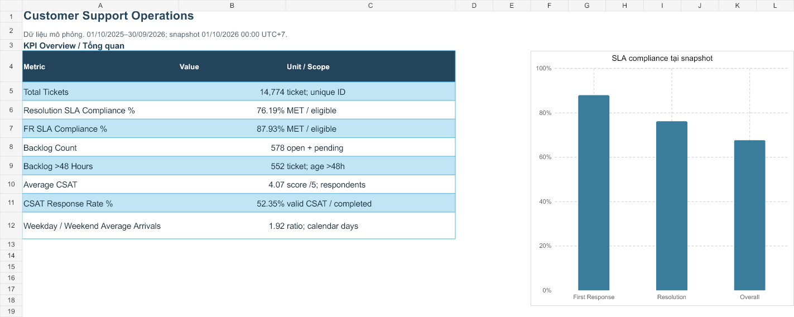
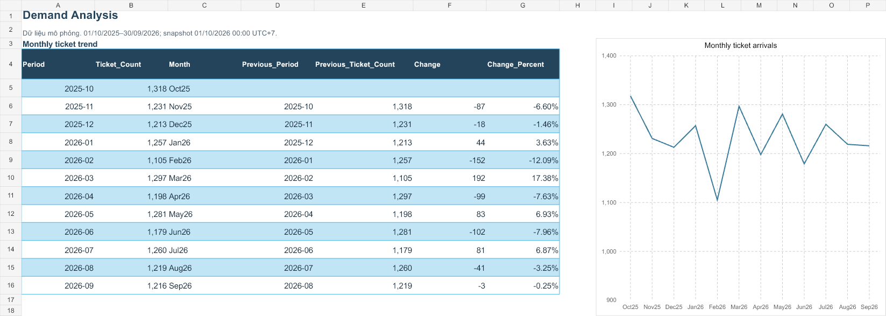

# Customer Support Operations Analytics

**Python · MySQL · Excel · Power BI specification**

## Bối cảnh / Context

Support manager cần hiểu ticket demand, SLA và aged backlog trước khi điều chỉnh coverage. Case study dùng dữ liệu mô phỏng, không đại diện cho một doanh nghiệp hay kinh nghiệm vận hành thực tế.

## Công việc đã thực hiện

Tôi kiểm tra grain/key của 5 nguồn, tách exact duplicates khỏi ambiguous records, giữ quarantine và reconcile từng dòng. Pipeline tính KPI từ 14,774 retained tickets, tách final-owner outcomes khỏi actual-handler effort. SQL lưu logic phân tích; workbook trình bày KPI, charts, sample size và rules. Power BI hiện có M, model, DAX và filter acceptance references, chưa có native dashboard hoàn thành.

## Kết quả đáng trình bày

Technical chiếm 29.49% volume, 50.09% resolution breaches; rate trong Technical là 40.44%. Weekday average 46.90 ticket/ngày cao 1.92x weekend average 24.37. Backlog 578 ticket, 552 quá 48h tại snapshot. [Mẫu số và giới hạn](05_business_insights.md)

## Sản phẩm

[Excel](../output/customer_support_analysis.xlsx) · [SQL](../sql/README.md) · [Data Quality](data_quality_report.md) · [Workbook previews](../images/workbook/README.md) · [Power BI package](../powerbi/README.md)

Preview được render từ XLSX bằng Artifact Tool; chưa capture Excel native. Các KPI nói về synthetic data và snapshot cố định.

Monthly demand hiển thị full coverage; dữ liệu tổng theo tháng không xác định hourly staffing.

## Đề xuất và giới hạn

Review technical handoff cùng priority mix; thử triage theo daily demand sau khi có handling timestamps; đọc CSAT cùng response rate. Đây là giả thuyết và đề xuất, không phải business achievements. Reopen Rate không phải FCR; daily FTE estimates không xác định exact shift gaps.

[How to Run](how_to_run.md) và [5 câu hỏi phỏng vấn](interview_questions.md). Workspace không có repo website để sửa layout/mobile/build; bản này dùng để tích hợp sau. Không chỉnh website qua URL công khai.
