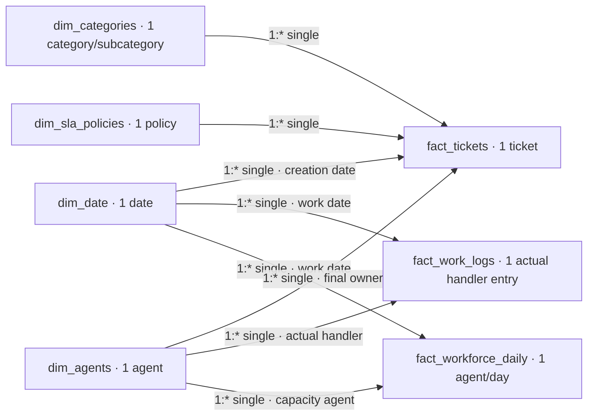

# Power BI semantic model

Implementation status: import-ready CSVs, measure definitions and the dashboard specification are supplied. A PBIX has not been built or validated in Power BI Desktop.

The primary analytical source is **data/processed/*.csv**. Excel in output/ is a presentation and inspection artifact. MySQL has not been loaded/validated here, so it is not the active source.

In Power Query, create blank queries using the named blocks in [processed_queries.pq](processed_queries.pq). Paste one block's expression per query into Advanced Editor; do not paste the whole file at once. Set ProjectFolder to the repository root and disable load for ProjectFolder and ReadProcessed. Load the seven model tables below. All five input files are processed CSVs; dates and categories are derived dimensions. No raw CSV or Excel workbook is imported.

These M queries implement the existing snapshot rules; Python remains the executed reference. Reconcile their output before claiming native validation. Stored Z timestamps are parsed as UTC instants; local creation fields explicitly use UTC+07:00, then stored event fields remain UTC Date/Time. Numeric durations are Decimal Number, completed is True/False, identifiers are Text and counts are Whole Number.

| Table | Source / derivation | Grain / primary key |
|---|---|---|
| dim_date | Power Query coverage calendar, including zero-arrival dates | Local date / date_key |
| dim_agents | data/processed/agents_clean.csv | Agent / agent_id |
| dim_categories | Distinct valid pairs from processed tickets | Category/subcategory / category_key |
| dim_sla_policies | data/processed/sla_policies_clean.csv | Channel/priority policy / policy_id |
| fact_tickets | data/processed/tickets_clean.csv, joined to policy targets and enriched in Power Query | Ticket outcome and final owner / ticket_id |
| fact_work_logs | data/processed/ticket_work_logs_clean.csv | Actual ticket/handler/date activity / work_log_id; alternate unique ticket_id + agent_id + work_date |
| fact_workforce_daily | data/processed/workforce_daily_clean.csv, with capacity fields derived in Power Query | Agent/local date / agent_id + work_date |

Create active 1:* relationships with single-direction filtering **from dimensions to facts**:

| Dimension key | Fact key |
|---|---|
| dim_date.date_key | fact_tickets.local_created_date |
| dim_date.date_key | fact_work_logs.work_date |
| dim_date.date_key | fact_workforce_daily.work_date |
| dim_agents.agent_id | fact_tickets.assigned_agent_id |
| dim_agents.agent_id | fact_work_logs.agent_id |
| dim_agents.agent_id | fact_workforce_daily.agent_id |
| dim_categories.category_key | fact_tickets.category_key |
| dim_sla_policies.policy_id | fact_tickets.policy_id |

Do not add active fact-to-fact relationships or bidirectional filters. The SQL model enforces log parent links, while the BI model avoids ambiguous filter paths. Selected Ticket Handling Hours uses TREATAS when a ticket category/channel cohort must filter effort. Regular Handling Hours and Utilization % describe handlers and their full day-level capacity; category and priority slicers do not filter workforce facts. Disable misleading visual interactions or state this scope in the title.

Agent filters mean **final owner** for ticket outcomes and **actual handler** for handling/capacity. An owner can differ from a handler. This distinction belongs in tooltips and table column labels. Date slicers select ticket creation cohorts and work dates, respectively; they do not select resolution dates. Backlog is always the 2026-10-01 00:00 Asia/Ho_Chi_Minh snapshot, optionally restricted by creation cohort, never historical daily backlog.

Mark dim_date as the date table using date_key; disable automatic date/time. Sort weekday_name by weekday_number and use month_start for monthly trend axes. The calendar contains all 365 coverage dates, including zero-arrival days. Previous-month measures require contiguous date selections. Rolling means include zero days and disclose partial windows during the first six days.

Paste measures individually from measures.dax; set rates to Percentage and durations to explicit minute/hour formats. BLANK at zero denominators is intentional. Compliance and breach denominators are MET + BREACHED; CSAT response denominator is completed tickets; reopen/backlog percentage denominator is the retained ticket cohort. Handling sums actual logs; productive capacity subtracts absence and shrinkage from scheduled time. Never add elapsed resolution time to handling effort.

Average Daily Tickets uses the selected calendar-day count, including zero-arrival days. Category contribution measures remove category filters for the denominator while retaining date/channel/priority scope. Median and P95 resolution measures use observed completion durations; P95 uses the inclusive linear estimator matching the Python export. All these measures still require validation in Desktop.

Acceptance in Desktop: after refresh, confirm 14,774 tickets, 17,901 work logs and 6,318 workforce rows. Check all dimension keys are unique and fact relationships have no unmatched IDs other than legitimate null unresolved owners. With filters cleared, compare cards and each SLA outcome count against verified_kpis.csv and the Excel Executive_KPIs sheet. Python/Excel values retain precision; displayed percentages round to two decimals. Check category, priority, date and agent filtering, zero-capacity BLANK and pending exclusions. M/DAX execution and rendered report verification remain manual.

The timezone preparation uses explicit [SwitchZone / RemoveZone operations](https://learn.microsoft.com/en-us/powerquery-m/datetimezone-functions); source parsing uses [Csv.Document](https://learn.microsoft.com/en-us/powerquery-m/csv-document). These references describe the functions, not validation of this unexecuted model.

## Sơ đồ model / Model diagram

Sơ đồ là model specification, chưa phải ảnh model đã mở trong Desktop. Không có active fact-to-fact relationship. SQL có FK parent checks, BI dùng TREATAS khi cần selected-ticket effort. Null unresolved owner được giữ ở ticket fact; cần xác nhận blank member behavior trong Desktop.

Quan trọng: Total Tickets, Resolution SLA Breach %, Resolution Breach Share %, CSAT Response Rate %, Backlog >48 Hours, Utilization %, Weekday Weekend Average Ratio. Thêm từng measure từ measures.dax. All và cohort expected values nằm trong acceptance_reference.json; chưa phải M/DAX execution results.
